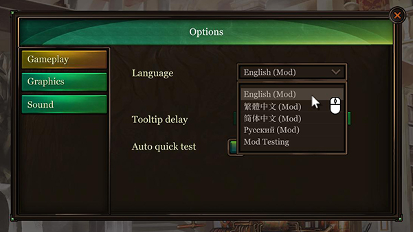

# AAW Language Mod

AAW Language Mod is an official mod for adding / customizing locale data for the game Alan's Automaton Workshop.

Steam page: https://store.steampowered.com/app/1289990  
Discord: https://discord.gg/r4P569Rc


## Installation

1. Find the 'Alan's Automaton Workshop_Data/Localization/' folder inside the game folder.

2. Copy all the files in this repository to the folder.

3. If the (Mod) suffix appeared in language field inside the option window in game, the installation is succeeded.




## Add Your Localization Files

1. Create a folder and name it by the language tag you wish to create. (You may duplicate and rename from an existing languages)

2. Insert the related entry inside the Languages.xml

Please noted that AAW is using [.Net language / region names](https://docs.microsoft.com/en-us/dotnet/api/system.globalization.cultureinfo?view=net-6.0#CultureNames) defined by BCP 47 to handle date and time formats. If your language tag (the folder name of your language) is not supported by .Net framework, the game will use English (en-us) date and time formats by default.

##### Example:

For Adding Japanese option into the mod, create a _ja-jp_ folder and insert the following line into Languages.xml
```
  <lang id="ja-jp">日本語</lang>
``` 


## File Structure

Each language folder should contain the following files:

|File             |Descriptions                                                   |
|-----------------|---------------------------------------------------------------|
|Data/Problem*.xml|The problem description files for each level                   |
|Image/*.png      |Localized image files for manual and tutorials                 |
|Cutscene_*.xml   |Files contain cutscene / dialogues                             |
|Journal.xml      |Automaton Journal used in library for additional levels        |
|Locale.xml       |Most of UI entries                                             |
|Manual.xml       |In-game user manual. Including tutorials and diagram reference |

If the required data file is not provided, the game will search it in the following order: Mod folder > Built-in language pack > Default language (en-us) pack

## FAQ

##### What can I do to fix a missing character?

Currently we did not allow adding custom fonts into the game. If you spot a missing character, please contact us.

##### Do I allowed to use the formatting tags?

In most of cases, the game support the [Unity Rich Text tags](https://docs.unity3d.com/Packages/com.unity.ugui@1.0/manual/StyledText.html). You may need the ```<![CDATA[ ]]>``` tags for escaping the tag you want to pass to Unity UI system.

##### How do I fix an overflowed / overlapped UI?

There're several ways to fix a locale text wider than desired UI length. The most common trick is using the ```<size>``` tag to force the UI field use a smaller font size to fit its width. You may referred to ```ru-ru/Locale.xml``` for more examples.


## License

The AAW Language Mod by Laputa Labs is licensed under the Creative Commons Attribution-NonCommercial-ShareAlike 4.0 International License. To view a copy of this license, visit
http://creativecommons.org/licenses/by-nc-sa/4.0/

  


